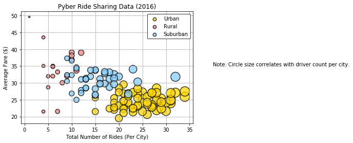
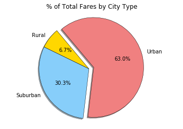
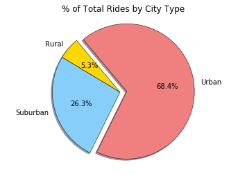
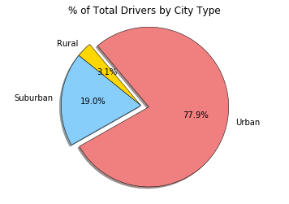

# Pyber Ride Sharing

### Analysis
-  Urban cities had the highest number of drivers. This can be seen by examining the size of the "urban" bubbles on the bubble plot. 
-  Urban cities had the highest percent of total fares at 63.0%.
-  Urban cities had the highest percent of total rides at 68.4%.
-  Urban cities had the highest percent of total drivers at 77.9%.
-  Although a rural city had the highest average fare, rural cities only made up 6.7% of the total fares.
-  Judging by the "Pyber Ride Sharing Data (2016)" bubble plot, a correlation can be seen between Number of Rides and the Average Fare per city. Urban cities had the highest number of rides and the lowest average fare rates of the three city types. Simply put, the more rides that occurred, the lower the average fare rates got.  


```python
# Dependencies
import pandas as pd
import numpy as np
import matplotlib.pyplot as plt
import seaborn as sns
```


```python
#File Paths
city_data = "raw_data/city_data.csv"
ride_data = "raw_data/ride_data.csv"

#File Reads
city_data = pd.read_csv(city_data)
ride_data = pd.read_csv(ride_data)

#Drop duplicate cities from city_data csv to prevent skewed data
city_data = city_data.drop_duplicates("city", keep="first")

#Merge files together into one DataFrame
pyber_data = pd.merge(city_data, ride_data, left_index=True, on="city")

#Display output
pyber_data.head()
```


<div>
<style scoped>
    .dataframe tbody tr th:only-of-type {
        vertical-align: middle;
    }

    .dataframe tbody tr th {
        vertical-align: top;
    }

    .dataframe thead th {
        text-align: right;
    }
</style>
<table border="1" class="dataframe">
  <thead>
    <tr style="text-align: right;">
      <th></th>
      <th>city</th>
      <th>driver_count</th>
      <th>type</th>
      <th>date</th>
      <th>fare</th>
      <th>ride_id</th>
    </tr>
  </thead>
  <tbody>
    <tr>
      <th>34</th>
      <td>Kelseyland</td>
      <td>63</td>
      <td>Urban</td>
      <td>2016-08-19 04:27:52</td>
      <td>5.51</td>
      <td>6246006544795</td>
    </tr>
    <tr>
      <th>122</th>
      <td>Kelseyland</td>
      <td>63</td>
      <td>Urban</td>
      <td>2016-04-17 06:59:50</td>
      <td>5.54</td>
      <td>7466473222333</td>
    </tr>
    <tr>
      <th>163</th>
      <td>Kelseyland</td>
      <td>63</td>
      <td>Urban</td>
      <td>2016-05-04 15:06:07</td>
      <td>30.54</td>
      <td>2140501382736</td>
    </tr>
    <tr>
      <th>171</th>
      <td>Kelseyland</td>
      <td>63</td>
      <td>Urban</td>
      <td>2016-01-25 20:44:56</td>
      <td>12.08</td>
      <td>1896987891309</td>
    </tr>
    <tr>
      <th>253</th>
      <td>Kelseyland</td>
      <td>63</td>
      <td>Urban</td>
      <td>2016-08-09 18:19:47</td>
      <td>17.91</td>
      <td>8784212854829</td>
    </tr>
  </tbody>
</table>
</div>


### Bubble Plot of Ride Sharing Data


```python
#Calculate "Average Fare Per City"
avg_fare = pyber_data.groupby("city")["fare"].mean()
#Calculate "Total Number of Rides Per City"
total_rides = pyber_data.groupby("city")["ride_id"].count()
#Calculate "Total Number of Drivers Per City"
total_drivers = pyber_data.groupby("city")["driver_count"].count()
#Calculate "City Type (Urban, Suburban, Rural)"
city_type = city_data.set_index("city")["type"]

#Create DataFrame
city_info = pd.DataFrame({"Average Fare Per City": avg_fare, 
                          "Number of Rides": total_rides, 
                          "Number of Drivers": total_drivers, 
                          "Type": city_type})
#city_info.head()

#Separate cities into categories based on type
rural = city_info[city_info["Type"] == "Rural"]
suburban = city_info[city_info["Type"] == "Suburban"]
urban = city_info[city_info["Type"] == "Urban"]

#Create scatterplot for "urban" city type
plt.scatter(urban["Number of Rides"], urban["Average Fare Per City"], color = "gold", edgecolors="black", s = urban["Number of Drivers"]*10, label = "Urban", alpha = 0.75, linewidth = 1.5)
#Create scatterplot for "rural" city type
plt.scatter(rural["Number of Rides"], rural["Average Fare Per City"], color = "lightcoral", edgecolors="black", s = rural["Number of Drivers"]*10, label = "Rural", alpha = 0.75, linewidth = 1.5)
#Creat scatterplot for "suburban" city type
plt.scatter(suburban["Number of Drivers"], suburban["Average Fare Per City"], color = "lightskyblue", edgecolors="black", s = suburban["Number of Drivers"]*10, label = "Suburban", alpha= 0.75, linewidth = 1.5)

#Aesthetics
plt.title("Pyber Ride Sharing Data (2016)")
plt.xlabel("Total Number of Rides (Per City)")
plt.ylabel("Average Fare ($)")
plt.text(40, 35,"Note: Circle size correlates with driver count per city.")

#Add legend
legend = plt.legend(frameon=True, edgecolor="black")
legend.legendHandles[0]._sizes = [40]
legend.legendHandles[1]._sizes = [40]
legend.legendHandles[2]._sizes = [40]

plt.grid()
plt.show()
```





### Total Fares by City Type


```python
#Group pyber data by type
by_type = pyber_data.groupby("type")

#Calculate "Total Fares by City Type"
total_fare = by_type["fare"].sum()

#Set pie chart labels
labels = total_fare.index

#Define color and explode values for all pie chart use
colors = ["gold", "lightskyblue", "lightcoral"]
explode = [0, 0, .1]

#Create pie chart for "% of Total Fares by City Type"
plt.pie(total_fare, startangle = 130, colors = colors, explode = explode, labels = labels, 
        autopct = "%1.1f%%", shadow = True, wedgeprops = {'linewidth': .5, 'edgecolor': 'black'})

#Format display
plt.title('% of Total Fares by City Type')
plt.axis('equal')
plt.show()
```





### Total Rides by City Type


```python
#Calculate "Total Rides by City Type"
ride_total = by_type["ride_id"].count()

#Set pie chart labels
labels = ride_total.index

#Create pie chart for "% of Total Rides by City Type"
plt.pie(ride_total, startangle = 130, colors = colors, explode = explode, labels = labels, 
        autopct = "%1.1f%%", shadow = True, wedgeprops = {'linewidth': .5, 'edgecolor': 'black'})

#Format display
plt.title('% of Total Rides by City Type')
plt.axis('equal')
plt.show()
```





### Total Drivers by City Type


```python
#Calculate "Total Drivers by City Type"
drivers_total = city_data.groupby("type")["driver_count"].sum()

#Set pie chart labels
labels = drivers_total.index

#Create pie chart for "% of Total Drivers by City Type"
plt.pie(drivers_total, startangle = 130, colors = colors, explode = explode, labels = labels, 
        autopct = "%1.1f%%", shadow = True, wedgeprops = {'linewidth': .5, 'edgecolor': 'black'})

#Format display
plt.title('% of Total Drivers by City Type')
plt.axis('equal')
plt.show()
```




